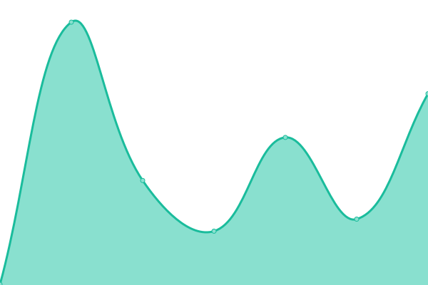

# [📈 Live Status](https://upptime.github.io/upptime): <!--live status--> **🟩 All systems operational**

This repository contains the open-source uptime monitor and status page for [Upptime](https://upptime.js.org), powered by [Upptime](https://github.com/upptime/upptime).

With [Upptime](https://upptime.js.org), you can get your own unlimited and free uptime monitor and status page, powered entirely by a GitHub repository. We use [Issues](https://github.com/upptime/upptime/issues) as incident reports, [Actions](https://github.com/upptime/upptime/actions) as uptime monitors, and [Pages](https://upptime.github.io/upptime) for the status page.

<!--start: status pages-->
<!-- This summary is generated by Upptime (https://github.com/upptime/upptime) -->
<!-- Do not edit this manually, your changes will be overwritten -->
<!-- prettier-ignore -->
| URL | Status | History | Response Time | Uptime |
| --- | ------ | ------- | ------------- | ------ |
|  [ethanjamesgreen.com](https://ethanjamesgreen.com) | 🟩 Up | [ethanjamesgreen-com.yml](https://github.com/emmalevesque/uptime/commits/HEAD/history/ethanjamesgreen-com.yml) | 

 158ms
     
 | 

<a href="https://upptime.github.io/upptime/history/ethanjamesgreen-com">100.00%</a>
    

|  [bulk-space.com](https://bulk-space.com) | 🟩 Up | [bulk-space-com.yml](https://github.com/emmalevesque/uptime/commits/HEAD/history/bulk-space-com.yml) | 

 163ms
     
 | 

<a href="https://upptime.github.io/upptime/history/bulk-space-com">100.00%</a>
    

|  [els.studio](https://els.studio) | 🟩 Up | [els-studio.yml](https://github.com/emmalevesque/uptime/commits/HEAD/history/els-studio.yml) | 

 126ms
     
 | 

<a href="https://upptime.github.io/upptime/history/els-studio">100.00%</a>
    

|  [chloeseibert.com](https://chloeseibert.com) | 🟩 Up | [chloeseibert-com.yml](https://github.com/emmalevesque/uptime/commits/HEAD/history/chloeseibert-com.yml) | 

 208ms
     
 | 

<a href="https://upptime.github.io/upptime/history/chloeseibert-com">100.00%</a>
    

|  [nyctransoralhistory.org](https://nyctransoralhistory.org) | 🟩 Up | [nyctransoralhistory-org.yml](https://github.com/emmalevesque/uptime/commits/HEAD/history/nyctransoralhistory-org.yml) | 

 1113ms
     
 | 

<a href="https://upptime.github.io/upptime/history/nyctransoralhistory-org">100.00%</a>
    

<!--end: status pages-->

[**Visit our status website →**](https://upptime.github.io/upptime)

## 📄 License

- Powered by: [Upptime](https://github.com/upptime/upptime)
- Code: [MIT](./LICENSE) © [Anand Chowdhary](https://anandchowdhary.com), supported by [Pabio](https://pabio.com)
- Data in the `./history` directory: [Open Database License](https://opendatacommons.org/licenses/odbl/1-0/)
